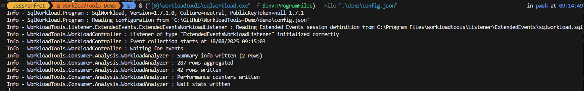
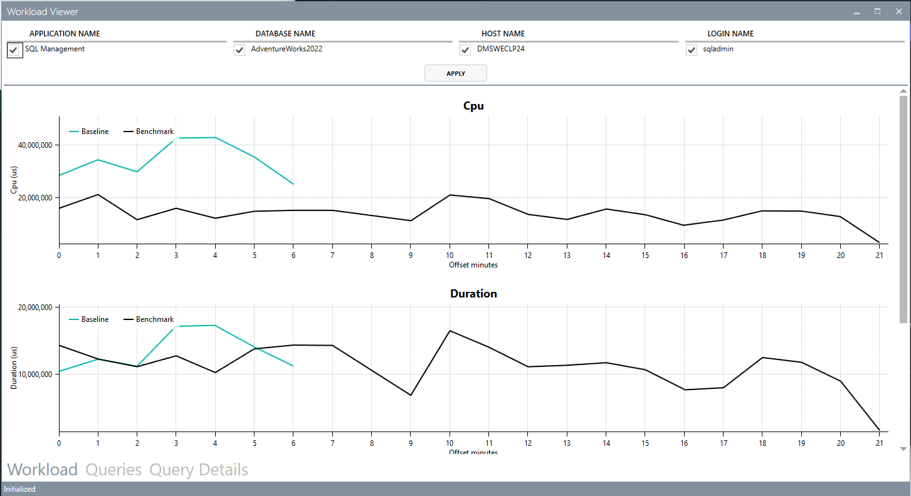
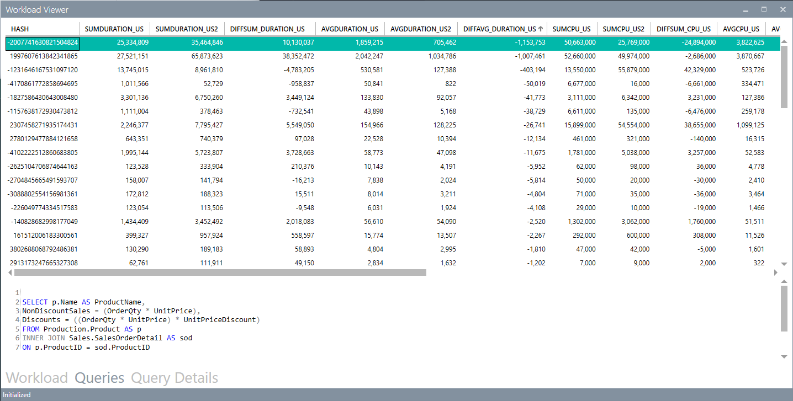
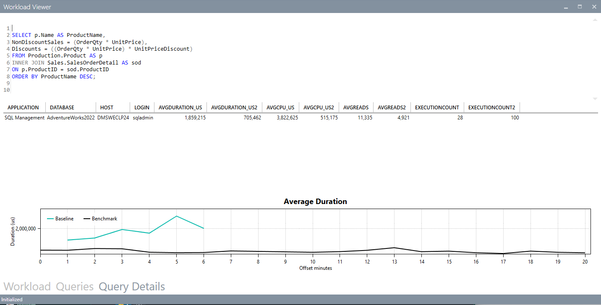

# Workload tools demo

Code for the tool is here: [github.com/spaghettidba/WorkloadTools](https://github.com/spaghettidba/WorkloadTools)

## Helpful Blog posts

- Intro - https://spaghettidba.com/2019/02/15/benchmarking-with-workloadtools/

## Setup

1. We need some containers - let's use one of Jess' that has AdventureWorks on

    ```powershell
    docker run -p 2500:1433 --volume shared:/shared:z --name mssql1 --hostname mssql1 --network localnet -d jpomfret7/dbatools1:latest
    docker run -p 2600:1433 --volume shared:/shared:z --name mssql2 --hostname mssql2 --network localnet -d jpomfret7/dbatools1:latest
    ```

1. Set up the [baseline.json](.\demo\baseline.json) to collect the workload

1. Start the collection

    ````powershell
    & ("{0}\workloadtools\sqlworkload.exe" -f $env:ProgramFiles) --File ".\demo\baseline.json"
    ````

1. Run a workload\some bad queries - it's good to have a few mins so you get perf details

    ```PowerShell
    .\RunWorkload.ps1 -SQLServer 'localhost,2500' -Database AdventureWorks2022 -UserName sqladmin -Password dbatools.IO -Frequency Fast -TSQLFile .\SqlScripts\AdventureWorksWorkload.sql
    ```

    

1. Ctrl+c to get out

1. Run the workload viewer

    ```powershell
    & ("{0}\workloadtools\workloadviewer.exe" -f $env:ProgramFiles) -S mssql1 -D workloadtools -M baseline -U sqladmin -P dbatools.IO
    ```

2. Fix the issues - add some indexes

    ```sql
    CREATE NONCLUSTERED INDEX idx1 ON [Sales].[SalesOrderDetail] ([ProductID]) INCLUDE ([OrderQty],[UnitPrice],[UnitPriceDiscount])
    CREATE NONCLUSTERED INDEX Idx2 ON [Sales].[SalesOrderDetail] ([OrderQty]) INCLUDE ([ProductID],[UnitPrice])
    CREATE NONCLUSTERED INDEX Idx3 ON [Sales].[SalesOrderDetail] ([CarrierTrackingNumber])
    ```

3. Start the [perftest.json](.\demo\perftest.json) collection this time

    ```powershell
    & ("{0}\workloadtools\sqlworkload.exe" -f $env:ProgramFiles) --File ".\demo\perftest.json"
    ```

4. Run the workload viewer to view `baseline` and `perftest` results

    ```powershell
    & ("{0}\workloadtools\workloadviewer.exe" -f $env:ProgramFiles) -S mssql1 -D workloadtools -M baseline -U sqladmin -P dbatools.IO -T mssql1 -E workloadtools -N perftest -V sqladmin -Q dbatools.IO
    ```

    
    
    
