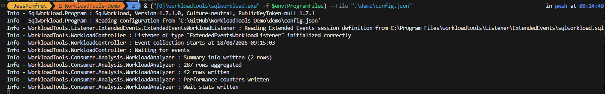

# Workload tools demo

Code is here: [github.com/spaghettidba/WorkloadTools](https://github.com/spaghettidba/WorkloadTools)


## Blog posts

- Intro https://spaghettidba.com/2019/02/15/benchmarking-with-workloadtools/

## setup

we need some containers

```powershell
docker run -p 2500:1433 --volume shared:/shared:z --name mssql1 --hostname mssql1 --network localnet -d dbatools/sqlinstance
docker run -p 2600:1433 --volume shared:/shared:z --name mssql2 --hostname mssql2 --network localnet -d dbatools/sqlinstance
```

set up the config.json

run the collection

```powershell
& ("{0}\workloadtools\sqlworkload.exe" -f $env:ProgramFiles) --File ".\demo\baseline.json"
```

run a workload\some queries



ctrl+c to get out

run the workload viewer

```powershell
& ("{0}\workloadtools\workloadviewer.exe" -f $env:ProgramFiles) -S mssql1 -D workloadtools -M baseline -U sqladmin -P dbatools.IO
```

add an index 

run the collection again

```powershell
& ("{0}\workloadtools\sqlworkload.exe" -f $env:ProgramFiles) --File ".\demo\perftest.json"
```

run the workload viewer to view baseline and perftest

```powershell
& ("{0}\workloadtools\workloadviewer.exe" -f $env:ProgramFiles) -S mssql1 -D workloadtools -M baseline -U sqladmin -P dbatools.IO -T mssql1 -E workloadtools -N perftest -V sqladmin -Q dbatools.IO
```